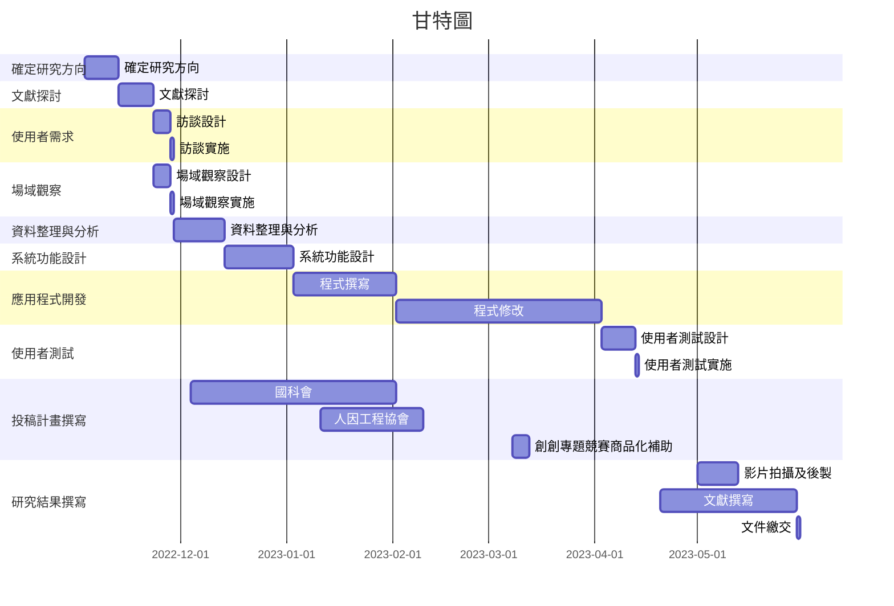

### 甘特圖

```mermaid
gantt
    title 甘特圖
    
    section 確定研究方向
    確定研究方向           :a1, 2022-11-03, 10d
    
	section 文獻探討
    文獻探討        :a2, after a1, 10d
    
	section 使用者需求
    訪談設計           :a3, after a2, 5d
	訪談實施           :a4, after a3, 1d
    
    section 場域觀察
    場域觀察設計           :a5, after a2, 5d
	場域觀察實施           :a6, after a3, 1d
    
    section 資料整理與分析
    資料整理與分析           :a7,after a6  , 15d
    
    section 系統功能設計
    系統功能設計           :a8,after a7  , 20d
    
    section 應用程式開發
    程式撰寫           :a9,after a8  , 30d
    程式修改           :a10,after a9  , 60d
    
    section 使用者測試
    使用者測試設計           :a11,after a10  , 10d
    使用者測試實施           :a12,after a11  , 1d
    
    section 投稿計畫撰寫
    國科會           :a13,2022-12-04  , 60d
    人因工程協會           :a14,2023-01-11  , 30d
    創創專題競賽商品化補助           :a15,2023-03-08  , 5d
    
    section 研究結果撰寫
    影片拍攝及後製         :a16,2023-05-01  , 12d
    文獻撰寫         :a17,2023-04-20  , 40d
    文件繳交    :a18,2023-05-30  , 1d

```
